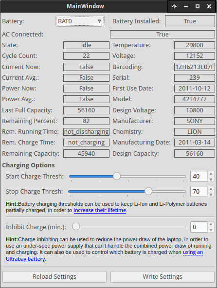

# tp_smapi_pyqt

GUI frontend for tp_smapi written using python and PyQt

Debian 8 Jessie screenshot:

### Running

On debian/ubuntu based distro installing `python-qt4` and `tp-smapi-dkms` is all that's required, you will also need `unzip` or some other archive extractor if you download the zip from github.

    $ sudo apt-get install python-qt4 tp-smapi-dkms
    $ wget https://github.com/Nikola-K/tp_smapi_pyqt/archive/master.zip
    $ unzip master.zip
    $ cd tp_smapi_pyqt-master/
    $ sudo python tp_smapi_pyqt.py
    
### License

    The MIT License (MIT)
    
    Copyright (c) 2015 Nikola Kovacevic
    
    Permission is hereby granted, free of charge, to any person obtaining a copy
    of this software and associated documentation files (the "Software"), to deal
    in the Software without restriction, including without limitation the rights
    to use, copy, modify, merge, publish, distribute, sublicense, and/or sell
    copies of the Software, and to permit persons to whom the Software is
    furnished to do so, subject to the following conditions:
    
    The above copyright notice and this permission notice shall be included in all
    copies or substantial portions of the Software.
    
    THE SOFTWARE IS PROVIDED "AS IS", WITHOUT WARRANTY OF ANY KIND, EXPRESS OR
    IMPLIED, INCLUDING BUT NOT LIMITED TO THE WARRANTIES OF MERCHANTABILITY,
    FITNESS FOR A PARTICULAR PURPOSE AND NONINFRINGEMENT. IN NO EVENT SHALL THE
    AUTHORS OR COPYRIGHT HOLDERS BE LIABLE FOR ANY CLAIM, DAMAGES OR OTHER
    LIABILITY, WHETHER IN AN ACTION OF CONTRACT, TORT OR OTHERWISE, ARISING FROM,
    OUT OF OR IN CONNECTION WITH THE SOFTWARE OR THE USE OR OTHER DEALINGS IN THE
    SOFTWARE.
    
